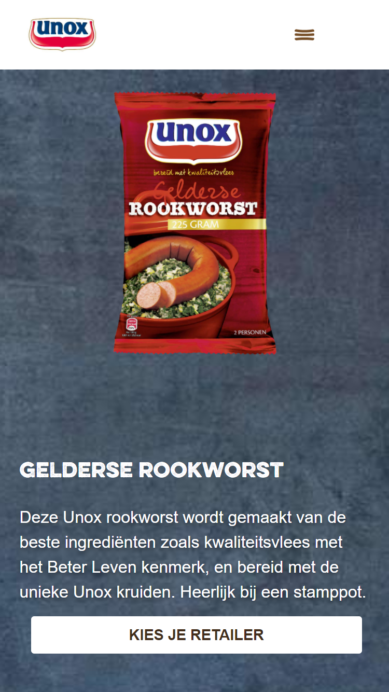
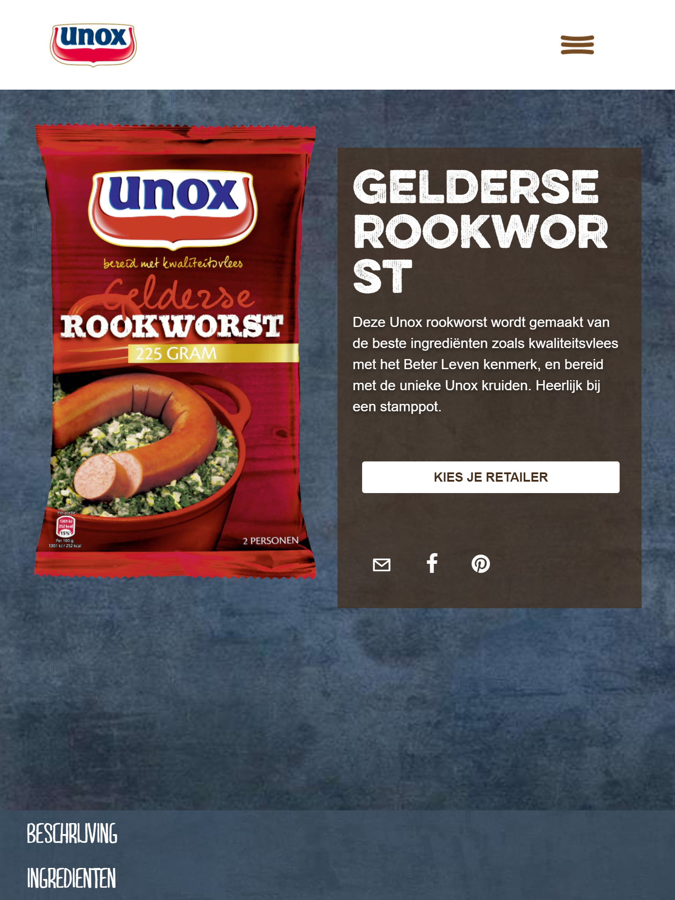
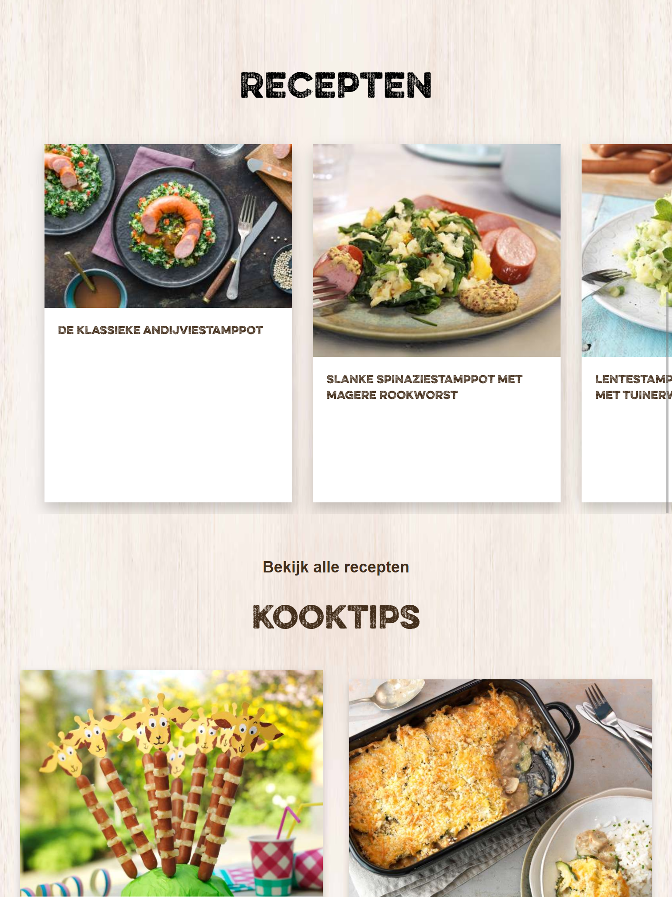
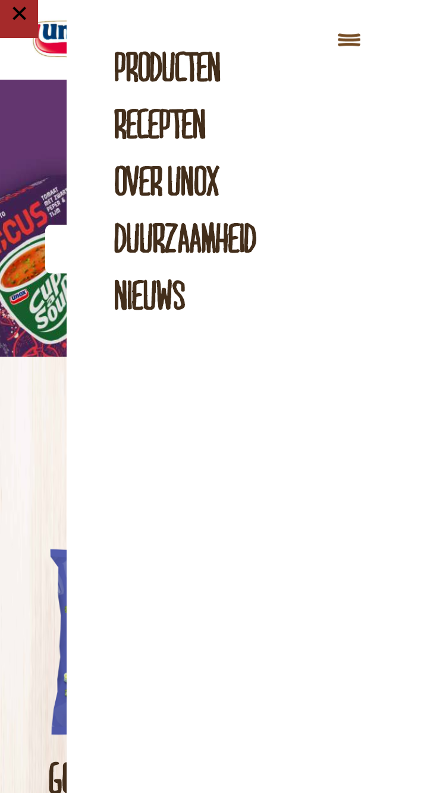
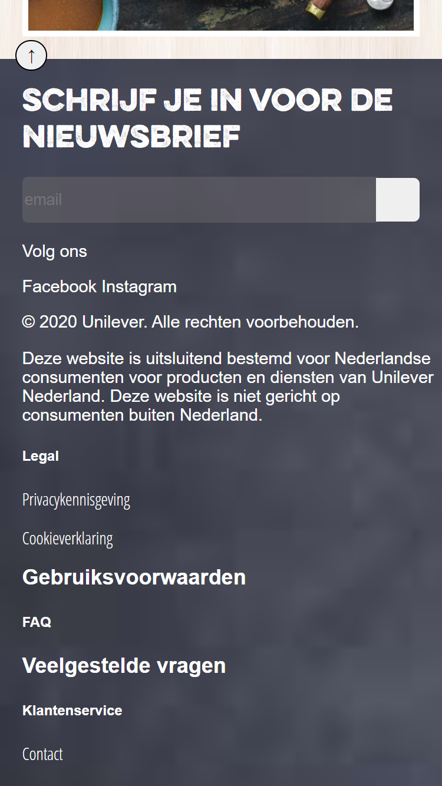
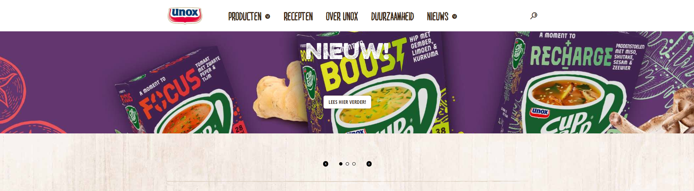
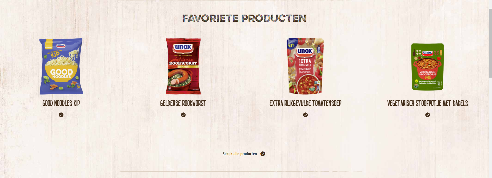
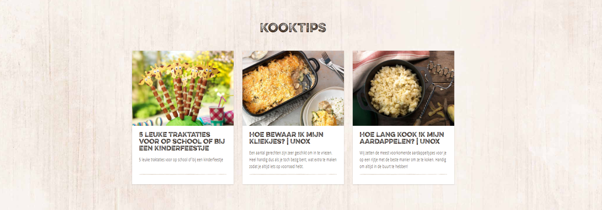
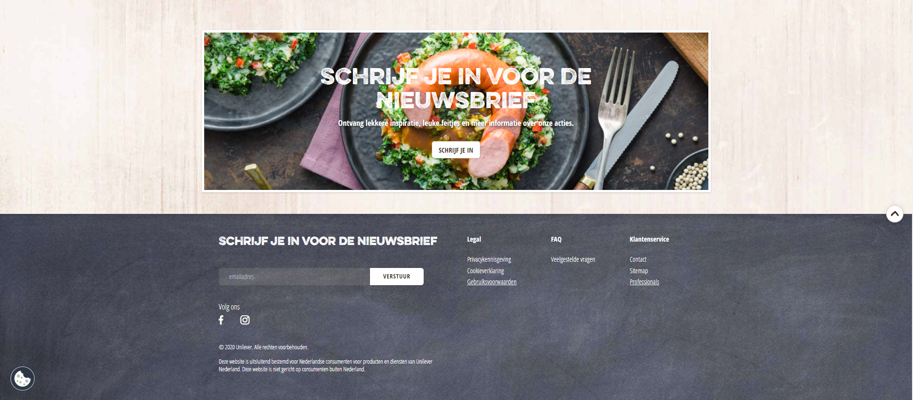
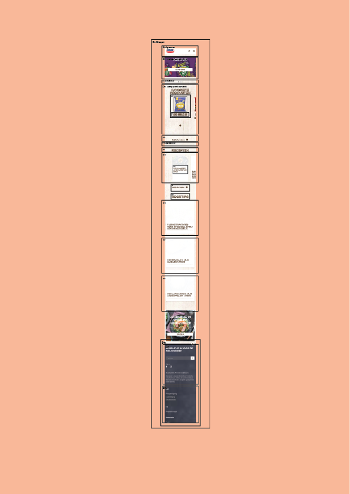

# Procesverslag
Michael Chorak

Markdown cheat cheet: [Hulp bij het schrijven van Markdown](https://github.com/adam-p/markdown-here/wiki/Markdown-Cheatsheet). Nb. de standaardstructuur en de spartaanse opmaak zijn helemaal prima. Het gaat om de inhoud van je procesverslag. Besteedt de tijd voor pracht en praal aan je website.


## Bronnenlijst

 - https://dlo.mijnhva.nl/d2l/le/content/192602/Home (opdrachten DLO)
 - CSS Animation property stays after animating. (2012, 19 maart). Stack Overflow. https://stackoverflow.com/questions/9774829/css-animation-property-stays-after-animating
 - Coyier, C. (2020, 22 oktober). A Complete Guide to Flexbox. CSS-Tricks. https://css-tricks.com/snippets/css/a-guide-to-flexbox/
 - Web Dev Simplified. (2019, 23 juli). Build Tabs Using HTML/CSS In Only 12 Minutes. YouTube. https://www.youtube.com/watch?v=5L6h_MrNvsk&ab_channel=EasyTutorials
 - Flexbox: center horizontally and vertically. (2013, 26 september). Stack Overflow. https://stackoverflow.com/questions/19026884/flexbox-center-horizontally-and-vertically
 - Richards, A. (2020, 3 februari). Const vs Let vs Var in Javascript. Which One Should You Use? Medium. https://levelup.gitconnected.com/const-vs-let-vs-var-in-javascript-which-one-should-you-use-c56cf9b9e2a3


## Herkansing (week 8)
- Active/hover states
  - De buttons hebben een :hover state gekregen.
 Een lineare gradient naar rechts met 3 states; 0% 40% 100% -> van 0% t/m 40% krijgt dit element een kleur van rgba(255,255,255,0) en van 40% tot 100% een kleurcode van (255,255,255,0.7).
 
- De kaarten met afbeeldingen hebben ook een :hover state meegekregen. Hiervoor heb ik een keyframe gemaakt;
 
 ```@keyframes zoomIn {
  from {transform: scale(1);
  }
  to {transform: scale(1.1);
  }
}
```
En de kaarten krijgen deze attributen mee;
```
.receptKaart > img:hover {
  animation-name: zoomIn;
  animation-iteration-count: 1;
  animation-duration: 1s;
  animation-fill-mode: forwards;
}
```
De animation-fill-mode zorgt er voor dat de afbeelding blijft ingezoomd zolang je muis er overheen hovert.

- Headings\
  H1 is nu nog maar 1x op de pagina te zien en de rest hebben andere headings meegekregen.
 
 - Javascript
   - Const en var zijn nu allemaal var
    - Const values kunnen niet veranderd worden en het is block-scoped dus je kan het alleen gebruiken in het block waar je const staat
    - Var kan je overal gebruiken zolang hij nog niet gedeclareerd is
    
     - Bron: Richards, A. (2020, 3 februari). Const vs Let vs Var in Javascript. Which One Should You Use? Medium. https://levelup.gitconnected.com/const-vs-let-vs-var-in-javascript-which-one-should-you-use-c56cf9b9e2a3
      
   Qua uiterlijk heb ik niks veranderd. Ik heb alle px verwijderd (alleen voor de borders en web-shadows niet) en heb deze gewijzigd in EM/REM/VH/VW.
   De code is nu wat semantischer dan de vorige keer en wat beter gestructueerd. 
   
   
      


## Eindgesprek (week 7/8)

De breakdown-points kiezen vond ik lastig en het juist positioneren van elementen was soms ook een enorme klus.
Wat betreft animatie/javascript is het een beetje schaars. Had hier wel wat meer tijd aan willen besteden helaas.
Voor de rest ging het vrij goed, eerste keer dat ik gelet heb op minder classes en divjes gebruik, zou in de toekomst natuurlijk nog beter moeten gaan maar het
semenatische gedeelte en nth-of-type selectoren snap ik nu wel goed.

Over het algemeen ben ik vrij blij met het resultaat. De volgende keer zou het misschien nog wat overzichtelijker in elkaar worden gezet. En meer complexiteit worden toegevoegd voor een nog leuker resultaat.

**Screenshot(s):**

-screenshot(s) van je eindresultaat-


## Voortgang 3 (week 6)
Begonnen aan de detailpagina. Header en footer waren al aanwezig dus we moesten werken aan main content.
Omdat ik voor het responsive gedeelte heb gekozen moest er veel elementen bewegen, dit was wel lastig om de juiste breakpoints te kiezen. 
Ik ben gaan werken met media queries en zo ziet het er op dit moment uit:




Nu moeten we de puntjes nog op de i zetten en ben van plan om een scroll to top button te maken.
Ook heb ik tijd geinvesteerd in het maken van een darkmode, helaas ben ik hier iets te laat mee begonnen en heb ik dit niet volledig werkend kunnen krijgen

## Voortgang 2 (week 5)

Veel aan de index pagina begonnen. Vooral aan de items met een soort slideshow. Deze kan je nu sliden v.l.n.r en vice versa

Ook heb ik een footer gemaakt die kan worden hergebruikt voor beide pagina's. Buiten dat een klein beetje javascript voor het menu




## Voortgang 1 (week 3)

1 Pagina bijna volledig af wat betreft HTML en CSS. JS ontbreekt voor de sliders en footer informatie

-dit ging goed & dit was lastig-
Ik ben opnieuw begonnen want de eerste versie was een mess en kwam er niet meer uit.
Ben aan een 2e versie begonnen met een betere structuur en logischere opmaak.
Positioneren en dergelijke ging goed voor mobile first, voor desktop ziet het er niet uit.

**Screenshot(s):**


-screenshot(s) van hoe ver je bent-

### Agenda voor meeting

We hebben een meeting gehad. Alleen geen concrete vragen uit gekomen. Meer onze huidige voortgang bespreken en
wat hulp vragen wat betreft de sliders in JS
### Verslag van meeting

-na afloop snel uitkomsten vastleggen-


## Intake (week 1)

**Je startniveau:** Blauwe pieste

**Je focus:** - Mijn keuze is responsive

**Je opdracht:** -https://www.unox.nl/

**Screenshot(s):**








**Breakdown-schets(en):**




