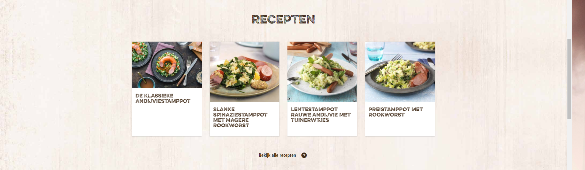

# Procesverslag
Michael Chorak

Markdown cheat cheet: [Hulp bij het schrijven van Markdown](https://github.com/adam-p/markdown-here/wiki/Markdown-Cheatsheet). Nb. de standaardstructuur en de spartaanse opmaak zijn helemaal prima. Het gaat om de inhoud van je procesverslag. Besteedt de tijd voor pracht en praal aan je website.

## Bronnenlijst
1. -bron 1-
2. -bron 2-
3. -...-

## Eindgesprek (week 7/8)

-dit ging goed & dit was lastig-

**Screenshot(s):**

-screenshot(s) van je eindresultaat-

## Voortgang 3 (week 6)

-same as voortgang 1-

## Voortgang 2 (week 5)
Mobile only pagina 1 af, wil deze perfectioneren voordat ik aan 2e begin omdat ik steeds meer ontdek tijdens het maken en veel moet wijzigen. Eerlijk gezegd niet heel veel voortgang geboekt, Hamburger menu deels gemaakt en footer content. Nog aan het werk met positioneren en hierna wil ik me focussen op responsiveness want dan ontbreekt nu wel.
Kijken of ik dit met media querys ga doen en kijken naar grid. Het begin is er wel, ontbreekt nog wel veel maar heb het gevoel dat ik sneller aanpassingen kan maken dan voorheen dus dit zou vanaf nu sneller moeten gaan.

## Voortgang 1 (week 3)

1 Pagina bijna volledig af wat betreft HTML en CSS. JS ontbreekt voor de sliders en footer informatie

-dit ging goed & dit was lastig-
Ik ben opnieuw begonnen want de eerste versie was een mess en kwam er niet meer uit.
Ben aan een 2e versie begonnen met een betere structuur en logischere opmaak.
Positioneren en dergelijke ging goed voor mobile first, voor desktop ziet het er niet uit.

**Screenshot(s):**

-screenshot(s) van hoe ver je bent-

### Agenda voor meeting

We hebben een meeting gehad. Alleen geen concrete vragen uit gekomen. Meer onze huidige voortgang bespreken en
wat hulp vragen wat betreft de sliders in JS
### Verslag van meeting

-na afloop snel uitkomsten vastleggen-

## Intake (week 1)

**Je startniveau:** Blauwe pieste

**Je focus:** - Mijn keuze is responsive

**Je opdracht:** -https://www.unox.nl/

**Screenshot(s):**

**Breakdown-schets(en):**

